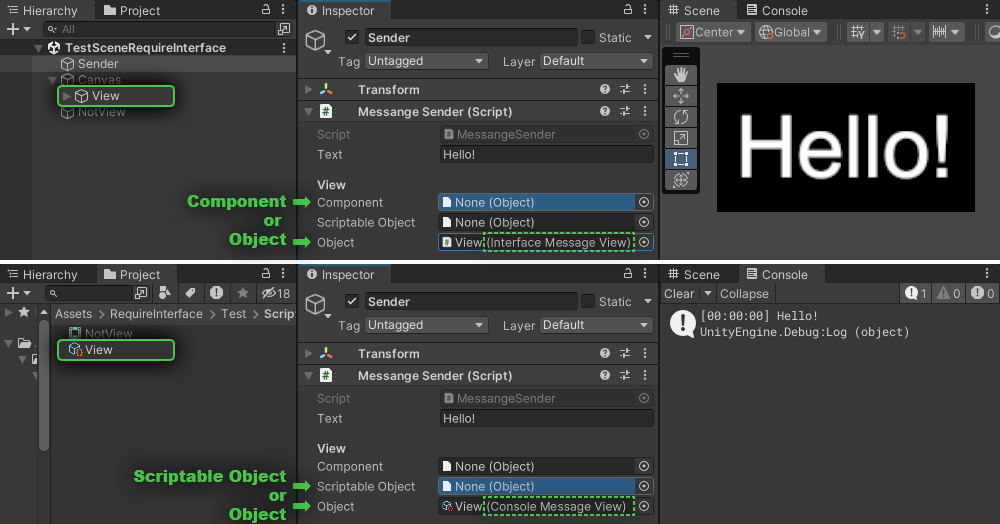

# Require Interface (Unity3D)
## Field attribute for inspector

An attribute for referencing an object that implements the target interface.
Can be used for fields of types:
- `Component` (`MonoBehaviour`)
- `ScriptableObject`
- `UnityEngine.Object`

When using an interface on a `MonoBehaviour` and dragging a `GameObject` with a component into the inspector field, a component implementing the specified interface is automatically assigned, or `null` if there is none.
If you try to assign a `ScriptableObject` that does not implement the target interface, `null` will also be assigned.
Using the `Object` type allows you to reference both `Component` and `ScriptableObject`.
___

## Example
```
public interface IMessageView
{
    public void SetText (string text);
}
```
```
public class InterfaceMessageView : MonoBehaviour, IMessageView
{
    [SerializeField] private Text _text;

    public void SetText (string text)
        => _text.text = text;
}
```
```
public class ConsoleMessageView : ScriptableObject, IMessageView
{
    public void SetText (string text)
        => Debug.Log(text);
}
```
```
public class MessageSender : MonoBehaviour
{
    [SerializeField] private string _text = "Hello!";
    [Header("View")]
    [SerializeField, RequireInterface(typeof(IMessageView))] private Component _component;
    [SerializeField, RequireInterface(typeof(IMessageView))] private ScriptableObject _scriptableObject;
    [SerializeField, RequireInterface(typeof(IMessageView))] private Object _object;

    [ContextMenu("View Message")]
    public void ViewMessage ()
    {
        if (_component != null)
            (_component as IMessageView).SetText(_text);
        if (_scriptableObject != null)
            (_scriptableObject as IMessageView).SetText(_text);
        if (_object != null)
            (_object as IMessageView).SetText(_text);
    }
}
```

___
## License

MIT